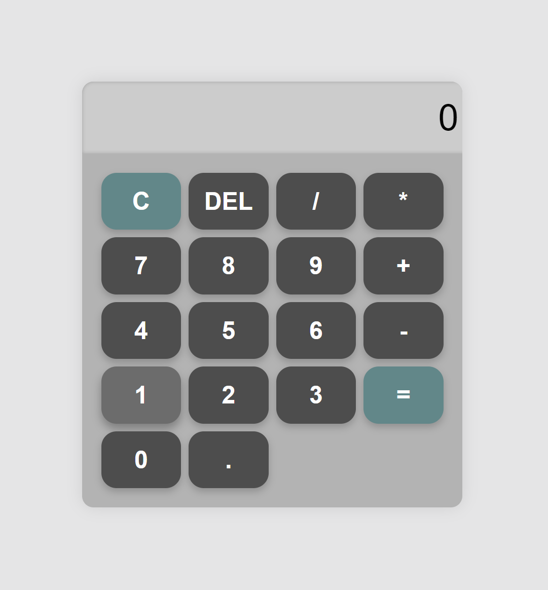

# Simple Web Calculator

This is a simple calculator app built using JavaScript, HTML and CSS. It performs basic arithmetic operations such as addition, subtraction, multiplication, and division.

## Demo



## Features

- Real-time calculation results
- Includes basic arithmetic operators (`+`, `-`, `*`, `/`)
- Clear (`C`) button to reset the display

### File Structure

```plaintext
.
├── App.js  # Main HTML file
├── index.css   # Stylesheet
├── index.js    # JavaScript logic
└── README.md   # Project documentation (this file)
```
